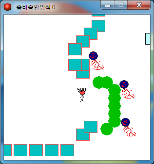

# 미친좀비막기2

[미친좀비막기](https://github.com/wnsrn3436/game-crazy-zombie-defense)의 후속작이다. 필드에 떨어진 검을 줍거나 좀비를 잡아 총을 얻으면 무기가 캐릭터를 졸졸 따라다니는 아이템 시스템을 넣었다.

  

## 플레이 방법

Releases에서 받아 실행하면 된다.

방향키로 움직인다. 필드에 떨어진 검을 주우면 검이 따라다니고 스페이스로 벤다. 좀비를 10마리 잡으면 총이 생기고 좌클릭으로 쏜다. 1과 2 키로 검과 총을 꺼내거나 집어넣는다. 잡은 좀비 수는 창 제목표시줄에 나온다.

## 구현 원리

무기가 따라다니는 건 매 스텝 플레이어 좌표를 향해 속도 5로 한 걸음씩 옮기는 방식이다. 부모 자식 관계 같은 걸 쓴 게 아니라 그냥 목표 지점을 향해 이동하는 액션 하나를 Step 이벤트에 걸었다. 그래서 무기가 캐릭터에 딱 붙어 있지 않고 살짝 늦게 따라온다.

잡은 좀비 수는 미친좀비막기에서 건물 수를 셀 때 쓴 `health` 값을 그대로 재활용했다. 좀비를 잡을 때마다 값을 올리고 제목표시줄에 "좀비죽인업적"으로 출력한다.

## 파일

| 경로 | 내용 |
|---|---|
| `source/crazy-zombie-defense-2.gmk` | 원본 프로젝트 파일 |
| `source/split/` | GmkSplitter로 분해한 텍스트 트리 |
| `docs/screenshots/` | 스크린샷 |
| Releases | 배포용 파일 |

## 라이선스

CC BY-NC-ND 4.0 라이선스다. 출처를 밝히면 비상업 용도로 그대로 공유할 수 있고, 수정본 배포와 상업적 이용은 금지한다. 함께 들어 있는 것 중 다른 사람이 만든 라이브러리와 그림·소리·맵은 각자의 권리를 따른다. 자세한 내용은 [LICENSE](LICENSE) 에 있다.
